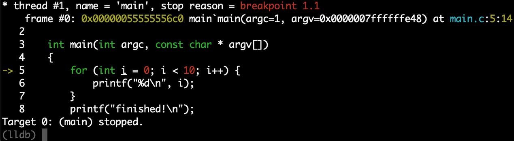

How to build and debug a native Android executable
==================================================

```
# make sure you have an Android phone plugged on a USB port and available to adb
# make sure you have ANDROID_SDK_HOME configured and added to the PATH
# make sure you have NDK_HOME configured and added to the PATH
# make sure you have lldb available in the host machine

# build the executable
ndk-build

# locate the lldb-server executable in the Android SDK
find $ANDROID_SDK_HOME -name lldb-server

# push the one applicable to your Android device archtecture
adb push __PATH_TO_LLDB_SERVER_IN_NDK_HOME/lldb-server /data/local/tmp/

# expose the port lldb-server default port to the host machine
adb forward tcp:5039 tcp:5039

# get into the Android's shell on a separate terminal session
adb shell

# change to the path where we uploaded lldb-server
cd /data/local/tmp

# run lldb-server
./lldb-server platform --server --listen localhost:5039

# back to the first terminal session, get into lldb REPL
lldb

# run the following commands
(lldb) platform select remote-android
(lldb) platform connect connect://localhost:5039
(lldb) file libs/__device_archtecture__/main
(lldb) b main.c:5
(lldb) r

# now you should see something similar to the following screen:
```


For more information, see [this](https://lldb.llvm.org/use/tutorial.html) page.
