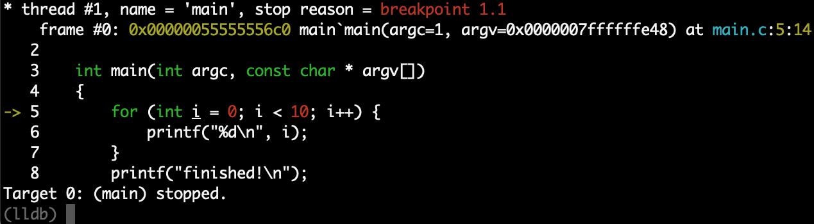
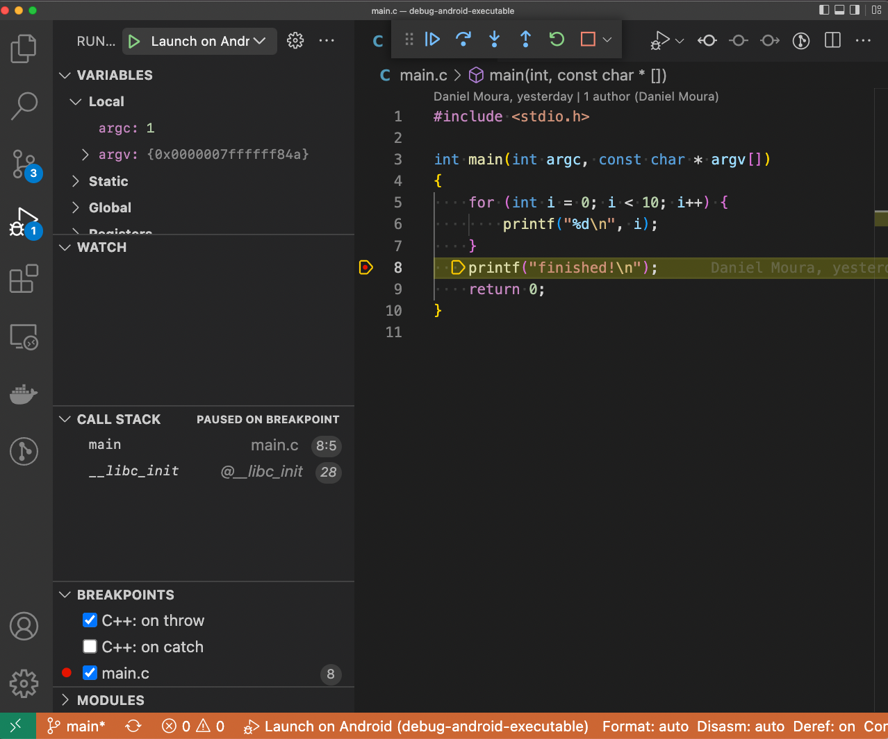

How to build and debug a native Android executable
==================================================


Common instructions
-------------------
- make sure you have an Android phone plugged on a USB port and available to adb
- make sure you have Android SDK installed and configured with `adb` and `ndk-build` available on the system PATH
```
# locate the lldb-server executable in the Android SDK
find $ANDROID_SDK_HOME -name lldb-server

# push the one applicable to your Android device archtecture
adb push __PATH_TO_LLDB_SERVER_IN_ANDROID_SDK_HOME/lldb-server /data/local/tmp/

# run lldb-server on Android in a separate terminal session
adb shell "cd /data/local/tmp && ./lldb-server platform --server --listen localhost:5039"
```

Debugging on command line (the harder way)
------------------------------------------
```
# open a new terminal session and make sure you have 'lldb' available on the host machine

# build the executable
ndk-build

# get into lldb REPL
lldb

# run the following commands
(lldb) platform select remote-android
(lldb) platform connect connect://localhost:5039
(lldb) file libs/__device_archtecture__/main
(lldb) b main.c:5
(lldb) r

# now you should see something similar to the following screen:
```


For more information, see [this](https://lldb.llvm.org/use/tutorial.html) page.

On Visual Studio Code (the easiest way)
---------------------------------------
- Make sure you have CodeLLDB extension installed
- Press F5 🙂
You should see something similar to the following screen:


